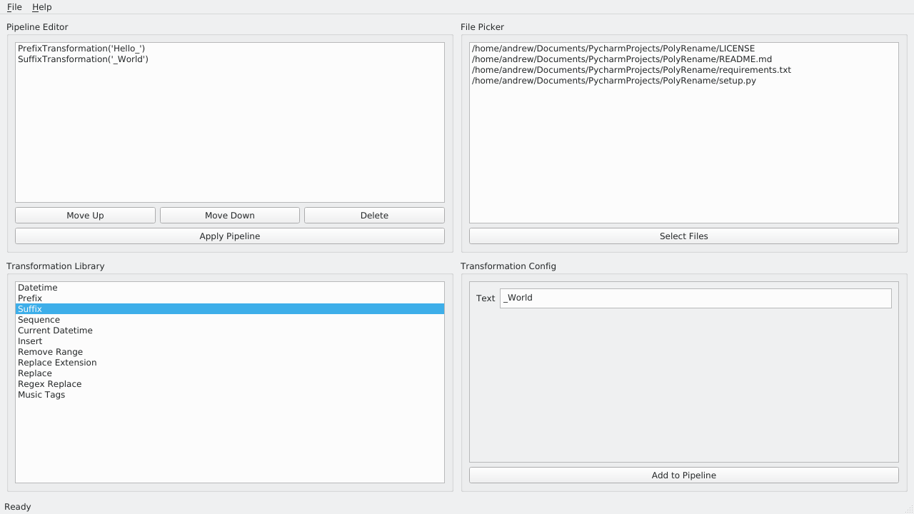
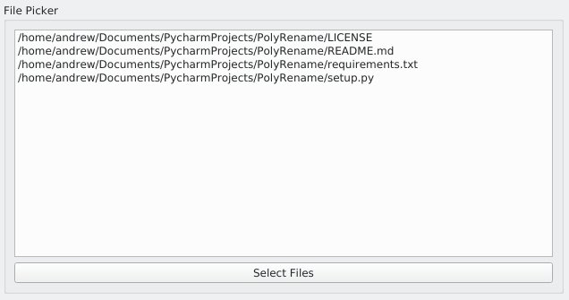
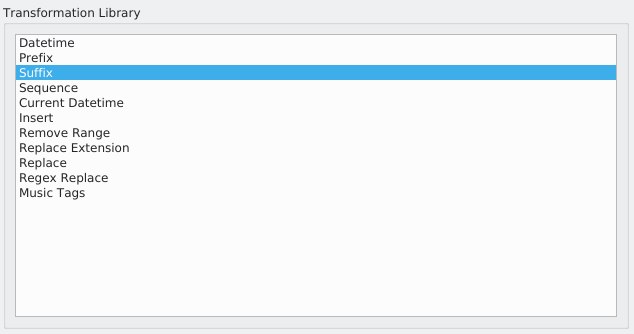
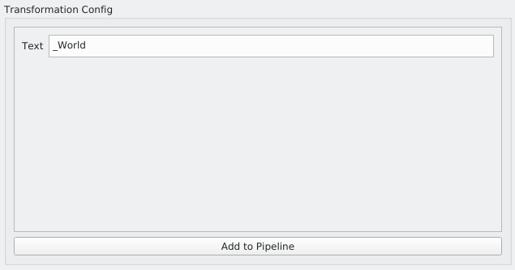
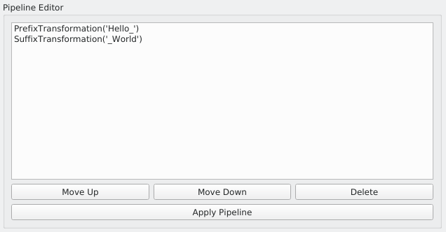
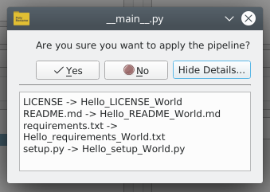

GUI
===

The user interface of PolyRename was designed to be simple to use, unlike many
other bulk-file rename tools. It’s GUI interface is divided into 4 quadrants.

At the top right is the File Picker. The file picker is used to select files on
the user’s computer, and to visualize which files (and in what order) are
currently selected.

At the bottom left is the Transformation Library. The transformation library is
automatically populated with the available transformations. From this interface,
the user can select a transformation to begin configuring that transformation.

At the bottom right is the Transformation Config. This interface allows the user
to configure the selected transformation before appending the configured
transformation to the pipeline. This interface performs error checking to ensure
that the user has entered a value for all required fields, and that all entered
values are of the expected datatype.

Finally, at the top left is the Pipeline Editor. The pipeline editor shows you
the current state of your pipeline, and allows you to modify your pipeline.
Modification actions include moving a configured transformation up or down in
the pipeline’s sequence or deleting a configured transformation from the
pipeline. Finally, this interface allows the user to apply a pipeline to their
selected file sequence. Upon pressing the “Apply Pipeline” button, a preview of
the resulting file sequence modifications is shown.

